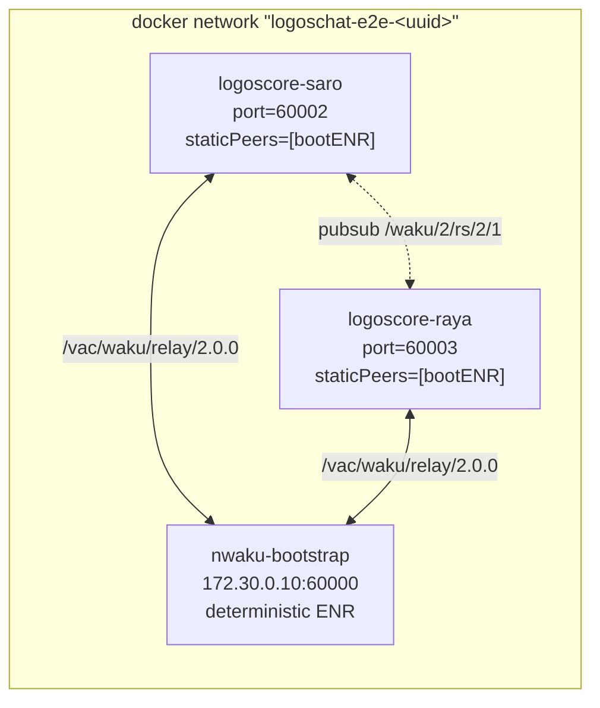

# logos-chat-module e2e tests

Two-user end-to-end chat check. Runs against built `chat_module` + `liblogoschat`
inside two `LogoscoreDockerDaemon` containers, plus a third `wakuorg/nwaku`
container as a static bootstrap-node. Per PR: red on regressions in
`chat_module` / `liblogoschat` / waku-stack.

Mock-based GTest unit tests live in `../tests/`. This is a separate suite that
runs the real stack.

Character names follow [`logos-messaging/specs:informational/chat_cast.md`](https://github.com/logos-messaging/specs/blob/master/informational/chat_cast.md):
**Saro** = sender (initiator), **Raya** = recipient.

## Architecture

Three containers in a shared docker network (`172.30.0.0/16`):



Saro and Raya find each other through the bootstrap-node's gossipsub mesh.
Both chat configs are generated on the fly in `conftest.py::chat_user_factory`
with the bootstrap ENR injected into `staticPeers`. The bootstrap's ENR is
**not** committed — it's read live from its REST API (`/debug/v1/info`) on each
test session, so an `nwaku` version upgrade doesn't silently invalidate a
stale fixture.

The bootstrap nodekey IS committed (`fixtures/bootstrap-nodekey.txt`) — it
fixes peerId across runs. **Do not reuse this nodekey on public waku
networks**; the peerId derived from it will collide with our test-node and
confuse external peer-discovery. Regenerate via `openssl rand -hex 32` if
you fork this test setup.

## Packaging note

We use `requirements.txt` instead of `pyproject.toml` because this is a test
harness, not a publishable package. The framework + pytest install via
`pip install -r requirements.txt`. `_helpers.py` is picked up by pytest's
rootdir mechanism — no installable module needed.

Both pinned dependencies (`logos-integration-test-framework` and `logoscore`)
live in **public** repos — `pip install` works without auth, no PAT needed.

## Prerequisites

- `docker` available on host.
- `LOGOSCORE_IMAGE` env: `logoscore:smoke-portable` built locally from
  `logos-co/logos-logoscore-py/tests/docker_smoke/Dockerfile` (one-time build).
- `LOGOS_MODULES_DIR` env: path to a directory containing
  `chat_module/manifest.json` (i.e. output of `nix build .#install-portable`
  on Linux, or `.#install` on macOS for local single-host mode — see
  «Local development» below).

If any of these is missing, all e2e tests skip with a clear reason.

## Running locally — Linux (CI mode)

```bash
# 1. Build chat-module in install-portable layout.
nix build .#install-portable
export LOGOS_MODULES_DIR=$PWD/result/modules

# 2. Build the logoscore docker image (one-time).
git clone https://github.com/logos-co/logos-logoscore-py.git /tmp/logoscore-py
cd /tmp/logoscore-py && git checkout aa45db52
bash tests/docker_smoke/build_smoke_image.sh
export LOGOSCORE_IMAGE=logoscore:smoke-portable
cd -

# 3. Pull nwaku.
docker pull wakuorg/nwaku:v0.38.0

# 4. Install + run tests.
cd tests/e2e
pip install -r requirements.txt
pytest -v
```

## Running locally — macOS

Local docker-mode on macOS (arm64) requires a Linux remote builder for
`nix build .#install-portable` (the `chat_module_plugin.so` Linux artifact),
which we don't ship setup for. Use the CI to validate locally during
shape-2 rollout. macOS host-process mode (Saro as a host `logoscore daemon`
+ nwaku in docker with `127.0.0.1:60000` mapping) is captured in the POC
notebook but not in `conftest.py` — it's a TODO for **step 2b**.

## Configuration schema

Chat configs are generated by `_helpers.make_chat_config(name, port,
bootstrap_enr)` and follow the schema understood by `liblogoschat`'s
`chat_new` (see `library/liblogoschat.h` and `library/api/client_api.nim` in
`logos-messaging/logos-chat`):

| Field | Type | Description |
|---|---|---|
| `name` | string | Identity name. **Note**: `chat_get_id` returns this string, NOT a libp2p peerId. |
| `port` | int | Waku TCP port. Each chat container binds its own. |
| `clusterId` | int | Waku cluster id. **Must be 2** to match the bootstrap's `--preset=logos.dev`. |
| `shardId` | int | Waku shard id. **Must be 1** to match the bootstrap's `--shard=1`. |
| `staticPeers` | string[] | List of bootstrap ENRs. **Only ENR strings** are accepted; multiaddrs do NOT work (`waku_client.nim`). |

> [!IMPORTANT]
> If you change `--preset` or `--shard` of the nwaku bootstrap, update
> `CHAT_CLUSTER_ID`/`CHAT_SHARD_ID` in `_constants.py` in lockstep. The pubsub
> topic `/waku/2/rs/{clusterId}/{shardId}` must match across all three
> containers, or messages won't propagate.

## Troubleshooting

### Container logs on failure

In CI, daemon logs are uploaded as `e2e-test-logs` artifact (see workflow).
Locally, `E2E_LOG_DIR` env (default `/tmp`) controls where `_save_logs`
callbacks write `<container_name>.log` files.

## CI

Active. `.github/workflows/ci.yml` has an `e2e-tests` job that runs on
`ubuntu-latest` with `needs: build-and-test`. Builds the install-portable
artefact, the smoke image, pulls nwaku, runs `pytest -v --maxfail=1`,
uploads logs on failure.
